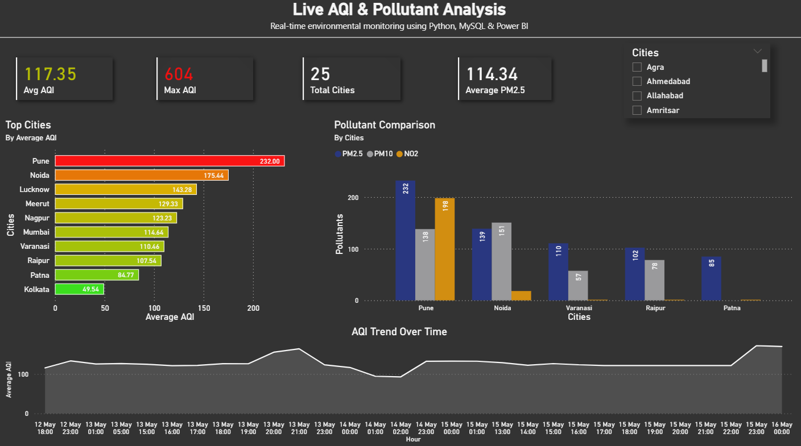
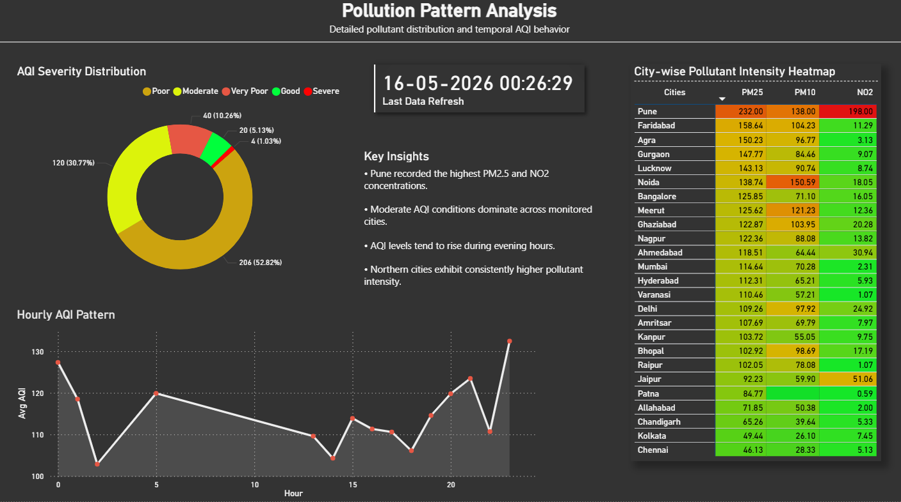

# 🌍 Live AQI & Pollutant Analysis Dashboard

A real-time Air Quality Index (AQI) monitoring and analytics system built using Python, MySQL, and Power BI.

This project automatically collects air quality data for major Indian cities, stores it in a MySQL database through an automated ETL pipeline, and visualizes insights through an interactive multi-page Power BI dashboard.

---

# 📌 Project Overview

The goal of this project is to:

* Monitor live AQI trends across Indian cities
* Analyze pollutant intensity patterns
* Automate data collection and storage
* Build a professional analytics dashboard for environmental monitoring
* Demonstrate end-to-end data analytics workflow

The system continuously fetches AQI and pollutant data using a public API, stores the processed data into MySQL, and visualizes the results using Power BI.

---

# ⚙️ Tech Stack

| Category        | Technologies                          |
| --------------- | ------------------------------------- |
| Programming     | Python                                |
| Database        | MySQL                                 |
| Data Processing | Pandas                                |
| API Handling    | Requests                              |
| Visualization   | Power BI                              |
| Automation      | Windows Task Scheduler + Batch Script |
| Environment     | Virtual Environment (.venv)           |

---

# 📂 Project Structure

```bash
live_aqi_analytics/
│
├── .venv/
├── assets/
│   └── monitoring_overview.png
│   └── pattern_exploration.png
│
├── logs/
│   └── pipeline_logs.txt
│
├── .env
├── .env.example
├── .gitignore
│
├── data_pipeline.py
├── db_config.py
├── main.py
│
├── schema.sql
├── requirements.txt
├── run.bat
├── README.md
│
└── powerbi_dashboard.pbix
```

---

# 🔄 ETL Pipeline Workflow

## 1. Extract

The Python pipeline fetches live AQI data from an external AQI API for multiple Indian cities.

Collected metrics include:

* AQI
* PM2.5
* PM10
* NO2
* O3
* SO2
* CO
* Timestamp

---

## 2. Transform

The fetched JSON data is cleaned and transformed using Pandas.

Processing includes:

* Filtering missing values
* Structuring pollutant columns
* Timestamp formatting
* Creating analytics-ready datasets

---

## 3. Load

The processed data is inserted into a MySQL database using `mysql-connector-python`.

The pipeline runs automatically through Windows Task Scheduler.

---

# 🗄️ Database Schema

Main table:

```sql
CREATE TABLE aqi_data (
    id INT AUTO_INCREMENT PRIMARY KEY,
    city VARCHAR(100),
    aqi FLOAT,
    pm25 FLOAT,
    pm10 FLOAT,
    no2 FLOAT,
    o3 FLOAT,
    so2 FLOAT,
    co FLOAT,
    timestamp DATETIME
);
```

---

# 📊 Power BI Dashboard Features

## Page 1 — Live AQI Monitoring Dashboard

### Features

* Average AQI KPI
* Maximum AQI KPI
* Total Cities Monitored
* Average PM2.5 KPI
* Top polluted cities visualization
* Pollutant comparison chart
* AQI trend over time
* Interactive city slicer

### Insights

* Identifies highly polluted cities
* Tracks AQI fluctuations over time
* Highlights dominant pollutants
* Provides real-time monitoring capability

---

## Page 2 — Pollution Pattern Analysis

### Features

* AQI severity distribution donut chart
* City-wise pollutant heatmap
* Hourly AQI pattern analysis
* Automated insights section
* Latest data refresh timestamp

### Insights

* Detects pollution intensity patterns
* Identifies dominant pollutants by city
* Analyzes hourly AQI behavior
* Visualizes AQI severity distribution

---

# 🤖 Automation Setup

The pipeline is automated using:

* Windows Task Scheduler
* Batch script (`run.bat`)

The scheduler periodically:

1. Activates the virtual environment
2. Runs the Python ETL pipeline
3. Logs execution details into `pipeline_logs.txt`

---

# ▶️ How to Run the Project

## 1. Clone the Repository

```bash
git clone https://github.com/your-username/live_aqi_analytics.git
cd live_aqi_analytics
```

---

## 2. Create Virtual Environment

```bash
python -m venv .venv
```

---

## 3. Activate Environment

### Windows

```bash
.venv\Scripts\activate
```

---

## 4. Install Dependencies

```bash
pip install -r requirements.txt
```

---

## 5. Configure Environment Variables

Create a `.env` file:

```env
MYSQL_HOST=localhost
MYSQL_USER=root
MYSQL_PASSWORD=your_password
MYSQL_DATABASE=aqi_db
```

---

## 6. Create Database

Run:

```sql
source schema.sql;
```

---

## 7. Run Pipeline

```bash
python main.py
```

---

# 🧠 Skills Demonstrated

This project demonstrates:

* Python programming
* ETL pipeline development
* REST API integration
* Data transformation with Pandas
* MySQL database management
* Power BI dashboard development
* Data visualization
* Automation scripting
* Analytical storytelling
* End-to-end analytics workflow

---

# 📸 Dashboard Preview

## Page 1 — Live AQI Monitoring Dashboard



---

## Page 2 — Pollution Pattern Analysis



---

# 👨‍💻 Author

**Rajan**

Aspiring Data Analyst passionate about:

* Data Analytics
* Data Visualization
* Automation
* Environmental Data Analysis
* Business Intelligence

---

# ⭐ If you found this project useful

Consider starring the repository and sharing feedback.
